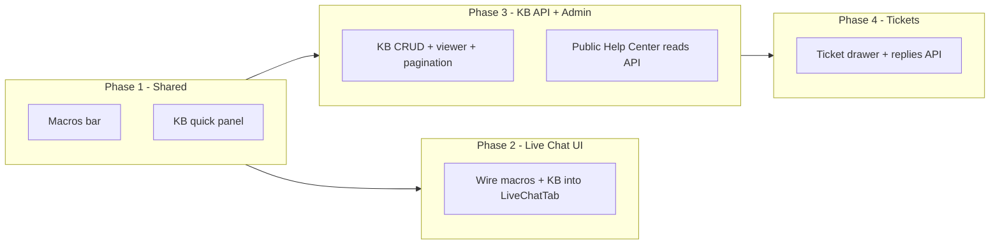

# Customer Support Redesign — Live Chat, Tickets & Knowledge Base

> **Branch:** `feature/admin` (Web) + API changes as needed  
> **Design source:** `.design-reference/backend/CustomerSupportV2.tsx` (React prototype, Jul 2026)  
> **Routes:** `/admin/support?tab=live-chat|tickets|knowledge`  
> **Public:** `/help` (Help Center)

---

## 1. What changed in the new design

The V2 prototype is a **major upgrade** over the original Figma export (`.design-reference/backend/CustomerSupport.tsx`). It adds shared agent tooling and richer KB/ticket workflows.

### Design tokens (V2 — Sapphire + Sky)

| Token | Hex | Usage |
|-------|-----|-------|
| INK | `#1E2A47` | Headings, primary buttons, agent bubbles |
| SKY | `#0088CC` | Accent, KB links, focus rings |
| SKY_BG | `#E1F0FA` | Soft accent surfaces |
| SUB | `#5B6B85` | Secondary text |
| MUTED | `#94A3BE` | Eyebrows, timestamps |
| LINE | `#E3E9F4` | Borders |
| SURF | `#FBFCFE` | Stat cards, step panels |

Headings use **Playfair Display** in the prototype; body stays Manrope (match admin shell).

### Three tabs (same shell as today)

| Tab | Component | Key new features |
|-----|-----------|------------------|
| **Live Chat** | `LiveChat` | Macros (canned replies), KB quick panel slide-over, close chat |
| **Support Tickets** | `TicketsTab` | Ticket drawer, team/agent assignment, priority, conversation thread, macros, KB panel |
| **Knowledge Base** | `KnowledgeBase` | Article editor with hero + agent steps, viewer with votes/comments, pagination, category carousel |

### Shared cross-tab features

- **CANNED_REPLIES** — 6 macros (Greeting, Order status, Return label, etc.)
- **KBQuickPanel** — search published articles while handling chat/tickets
- **KBButton** — opens quick panel from Live Chat & Tickets headers
- **Toast / ConfirmDelete** — feedback patterns

---

## 2. Current state vs target

### Live Chat

| Area | Today (Blazor) | Target (V2) |
|------|----------------|-------------|
| Data | Real API (`IChatService`, polling) | Same — already wired |
| Sidebar | Sessions + message count badges | Match design layout; optional order link if we have order context |
| Thread | Bubbles, send, close session | Add **Macros** strip above input |
| KB access | None | **KB quick panel** (right drawer, shifts layout) |
| Stats row | Active / Waiting / Resolved today | Keep (design omits stats — ours is fine) |

**Gap:** Low API work. Mostly UI + shared components.

### Support Tickets

| Area | Today (Blazor) | Target (V2) |
|------|----------------|-------------|
| Data | API list + status update only | Full ticket ops |
| UI | Table/list, inline status | **Drawer** with customer card, filters, conversation |
| Assignment | None | Team + Agent dropdowns, “Assign to me” |
| Priority | Filter only | Editable in drawer |
| Replies | None | Thread UI + `addReply` |
| Macros / KB | None | Same as Live Chat |

**Gap:** Medium–large API + DB work.

### Knowledge Base

| Area | Today (Blazor) | Target (V2) |
|------|----------------|-------------|
| Data | **In-memory seed** (`HelpArticleSeed`) | Persisted API + public Help Center feed |
| Editor | Title, category, status, content | + **hero image**, **agent steps** (detail + optional image) |
| Viewer | Edit drawer only | Read-only **ArticleView** with views/helpful, votes, agent comments |
| List | Filters, stats | + pagination (10/page), collapsible search, step-guide badges |
| Public `/help` | Separate page | Must read **published** articles from same store |

**Gap:** Large API + DB + migration from seed.

---

## 3. Data model (proposed)

### Knowledge Base (new tables)

```text
help_articles
  id              uuid PK
  title           text NOT NULL
  category        text NOT NULL  -- Orders|Shipping|Returns|Payments|Account|Product Info
  content         text NOT NULL
  status          text NOT NULL  -- draft|published
  hero_image_url  text NULL
  view_count      int DEFAULT 0
  helpful_count   int DEFAULT 0
  created_at      timestamptz
  updated_at      timestamptz
  published_at    timestamptz NULL

help_article_steps
  id              uuid PK
  article_id      uuid FK → help_articles
  sort_order      int NOT NULL
  detail          text NOT NULL
  image_url       text NULL

help_article_votes          -- optional v1: aggregate only on article
  article_id      uuid FK
  voter_key       text       -- admin user id or anonymous key
  vote            text       -- like|dislike
  PRIMARY KEY (article_id, voter_key)

help_article_comments       -- agent-only internal notes
  id              uuid PK
  article_id      uuid FK
  author_id       uuid FK → profiles NULL
  author_name     text
  body            text
  created_at      timestamptz
```

### Support Tickets (extend existing)

Current `support_tickets` has: id, ticket_number, name, email, category, subject, message, priority, status, timestamps.

**Add columns:**

```text
assigned_to       uuid NULL FK → profiles
assigned_to_name  text NULL      -- denormalized for display
team              text NULL      -- Support Team|Billing Team|...
first_response_at timestamptz NULL
```

**New table:**

```text
support_ticket_replies
  id              uuid PK
  ticket_id       uuid FK → support_tickets
  sender_type     text NOT NULL  -- customer|agent
  sender_id       uuid NULL
  sender_name     text NULL
  message         text NOT NULL
  created_at      timestamptz
```

### Canned replies (optional Phase 4)

Start with **static config** in Web (`SupportCannedReplies.cs` mirroring prototype). Later:

```text
support_canned_replies
  id, label, body, sort_order, is_active, created_by
```

---

## 4. API plan (MuuqWearApi)

### Phase A — Knowledge Base CRUD + public read

| Method | Route | Auth | Notes |
|--------|-------|------|-------|
| GET | `api/HelpCenter/articles` | Public | Published only; category + search query |
| GET | `api/HelpCenter/articles/{id}` | Public | Increment view_count |
| POST | `api/HelpCenter/articles/{id}/helpful` | Public | Optional thumbs-up counter |
| GET | `api/HelpCenter/admin/articles` | Support+ | Paginated, all statuses |
| GET | `api/HelpCenter/admin/articles/{id}` | Support+ | Full article + steps + comments |
| POST | `api/HelpCenter/admin/articles` | Support+ | Create draft/published |
| PUT | `api/HelpCenter/admin/articles/{id}` | Support+ | Update + replace steps |
| PATCH | `api/HelpCenter/admin/articles/{id}/status` | Support+ | Publish/unpublish |
| DELETE | `api/HelpCenter/admin/articles/{id}` | Support+ | Soft or hard delete |
| POST | `api/HelpCenter/admin/articles/{id}/comments` | Support+ | Agent comment |
| POST | `api/HelpCenter/admin/articles/{id}/vote` | Support+ | Like/dislike (admin preview) |

**Service:** extend `HelpCenterService` or split `KnowledgeBaseService`.

### Phase B — Ticket drawer operations

| Method | Route | Auth | Notes |
|--------|-------|------|-------|
| GET | `api/HelpCenter/tickets/{id}` | Support+ | Already exists — extend DTO |
| PATCH | `api/HelpCenter/tickets/{id}` | Support+ | status, priority, team, assigned_to |
| GET | `api/HelpCenter/tickets/{id}/replies` | Support+ | Conversation thread |
| POST | `api/HelpCenter/tickets/{id}/replies` | Support+ | Agent reply; set first_response_at |
| POST | `api/HelpCenter/tickets/{id}/assign-me` | Support+ | Shortcut for current admin |

Extend `SupportTicketDTO` with: `Team`, `AssignedTo`, `AssignedToName`, `Replies[]`, `FirstResponseAt`.

### Phase C — Live Chat (minimal API)

Chat API is largely done. Optional enhancements:

- Link session → order id (if customer authenticated)
- Store/display canned reply usage (analytics only — skip v1)

---

## 5. Web plan (MuuqWear)

### Shared components (build once under `Support/`)

| Component | Purpose |
|-----------|---------|
| `SupportMacrosBar.razor` | Toggle + horizontal macro chips |
| `SupportKbQuickPanel.razor` | Search + open published articles |
| `SupportKbArticleViewPanel.razor` | Read-only article viewer (admin) |
| `SupportDrawerShell.razor` | Right slide-over with overlay |
| `SupportToast.razor` | Already partially exists as `cs-toast` |
| `SupportConfirmDelete.razor` | Modal pattern |

Constants: `SupportCannedReplies.cs`, reuse `HelpCategoryMeta` / extend for steps.

### Tab implementation order



#### Phase 1 — Shared agent tooling (Web only, ~2–3 days)

1. Extract `CANNED_REPLIES` to `SupportCannedReplies.cs`
2. Build `SupportMacrosBar` + insert into `AdminSupportLiveChatTab`
3. Build `SupportKbQuickPanel` (reads articles — seed data until Phase 3 API)
4. Add KB button to Live Chat + Tickets tab headers

#### Phase 2 — Live Chat polish (~1–2 days)

1. Layout tweaks to match V2 (subtitle, KB button row)
2. Shift main panel when KB drawer open (`margin-right` equivalent)
3. Verify macros don’t break send/poll flow

#### Phase 3 — Knowledge Base backend + admin (~5–7 days)

1. **API:** migrations + `HelpCenter` admin endpoints
2. **Web:** `IHelpCenterService` / `IKnowledgeBaseService` client methods
3. Replace `HelpArticleSeed` with API load in `AdminSupportKnowledgeBaseTab`
4. Editor: hero image URL, dynamic steps list
5. Article view panel: stats, steps, votes, comments
6. Pagination (10 per page), collapsible search icon
7. **Public** `HelpCenterComponent`: fetch published articles from API
8. Seed migration script: import current `HelpArticleSeed` rows into DB

#### Phase 4 — Support Tickets drawer (~4–5 days)

1. **API:** replies table + PATCH ticket assignment
2. **Web:** `AdminSupportTicketsTab` → list + **TicketDrawer** (replace inline actions)
3. Wire status, priority, team, agent selects
4. Conversation thread + reply box + macros
5. KB quick panel from drawer header
6. “Assigned to me” filter (already partially in design)

#### Phase 5 — Polish & tests (~2 days)

1. Playfair Display on tab titles only (if brand approves)
2. E2E smoke: create article → publish → visible on `/help`
3. E2E: ticket reply → customer notification (future: email)
4. API unit tests for KB + ticket replies
5. Update `ADMIN_REDESIGN.md` §5.7 to reference V2

---

## 6. File map

### Design reference

| File | Role |
|------|------|
| `.design-reference/backend/CustomerSupportV2.tsx` | **New** full React prototype (source of truth for this upgrade) |
| `.design-reference/backend/CustomerSupport.tsx` | Original simpler Figma export (keep for history) |

### Web — primary touch points

| File | Action |
|------|--------|
| `AdminSupportLiveChatTab.*` | Add macros, KB panel |
| `AdminSupportTicketsTab.*` | Rebuild with drawer |
| `AdminSupportKnowledgeBaseTab.*` | Editor/viewer/pagination + API |
| `AdminCustomerSupportComponent.razor.css` | Drawer, macros, KB panel styles |
| `HelpCenterComponent.*` | Public article feed from API |
| `MuuqWear.Model/HelpCenter/*` | Extend models (steps, votes, comments) |
| `MuuqWear.Application/Services/HelpCenterService/*` | New API calls |

### API — primary touch points

| File | Action |
|------|--------|
| `HelpCenterController.cs` | Admin + public KB routes |
| `HelpCenterService.cs` | KB CRUD, views, comments |
| `SupportTicket.cs` + migration | Assignment columns |
| `support_ticket_replies` | New model + service methods |
| `help_articles` + related | New models |

---

## 7. Risks & decisions

| Topic | Recommendation |
|-------|----------------|
| KB votes on public site | V1: `helpful_count` increment only; full per-user votes in admin viewer optional |
| Agent comments on articles | Admin-only; not shown on public Help Center |
| Ticket email notifications | Out of scope for UI redesign; add later when reply API exists |
| Order # on live chat | Show if session has linked user + recent order; else hide |
| Canned replies storage | Static C# list for v1; DB later if admins need to edit |
| Rich text editor | Stay plain textarea for v1 (matches prototype) |

---

## 8. Suggested first PR

**PR 1 — Shared macros + KB quick panel (Web only)**  
Small, reviewable, immediately improves Live Chat + Tickets UX without blocking on DB.

**PR 2 — Knowledge Base API + admin persistence**  
Unblocks public Help Center and KB quick panel real data.

**PR 3 — Ticket drawer + replies API**  
Largest ticket workflow piece.

---

## 9. Acceptance checklist (per phase)

### Phase 1
- [ ] Macros appear on Live Chat and pre-fill input
- [ ] KB button opens searchable panel from Live Chat & Tickets
- [ ] Panel closes without breaking chat polling

### Phase 3
- [ ] Articles persist across reload (not seed memory)
- [ ] Publish makes article visible on `/help`
- [ ] Editor supports cover image + ordered steps
- [ ] Article viewer shows steps, comments, publish stats
- [ ] Pagination works (10 per page)

### Phase 4
- [ ] Ticket drawer opens from list row
- [ ] Agent can reply; thread persists
- [ ] Assign team/agent; filter “Assigned to me”
- [ ] Status/priority update via API

---

*Last updated: Jul 2026 — design saved from product handoff React prototype.*
